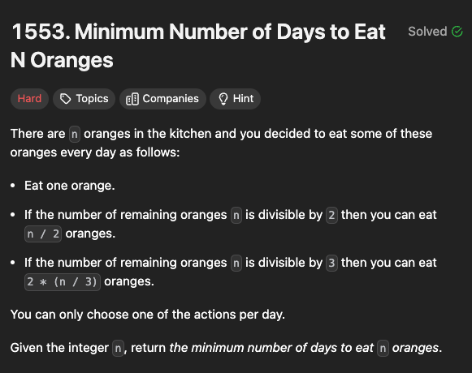

###  1553. Minimum Number of Days to Eat N Oranges

## What is this problem about?
This problem is an implementation of DFS/BFS and memoization.


So the actual optimal solution is just a slightly more optimized DFS with memoization.

```python
class Solution:
    def minDays(self, n: int) -> int:
        mem = {0: 0, 1: 1}
        def dfs(n):
            if n in mem:
                return mem[n]
            a = 1 + (n % 2) + dfs(n // 2)
            b = 1 + (n % 3) + dfs(n // 3)
            mem[n] = min(a, b)
            return mem[n]
        return dfs(n)
```
You do the (n%2) thingy because it gives 2 options, divide by two or three and having 1 stored in the memoization, you
don't need to worry about the one case. The worst case for this problem is 2log(n/2) = log(n/2).

## BFS solution
So this solution is like not very optimal. It is 3^(log2n).

``` Python

class Solution:
    def minDays(self, n: int) -> int:
        ans = 0
        queue = [n]
        seen = set()
        while queue: #bfs 
            newq = []
            for x in queue: 
                if x == 0: return ans 
                seen.add(x)
                if x-1 not in seen: newq.append(x-1)
                if x % 2 == 0 and x//2 not in seen: newq.append(x//2)
                if x % 3 == 0 and x//3 not in seen: newq.append(x//3)
            ans += 1
            queue = newq 
```

## Brute Force

```python
class Solution:
    def minDays(self, n: int) -> int:
        return self.dfs(n)
        
        
    def dfs(self, n: int):
        if n == 0:
            return 0 
        a,b,c  = 9999999, 9999999, 9999999
        if (n % 3 == 0):
            a = 1 + self.dfs(n/3)
        if (n % 2 == 0):
            b = (1 + self.dfs(n/2))

        c = 1 + self.dfs(n-1)
        return min(a, b, c)

```