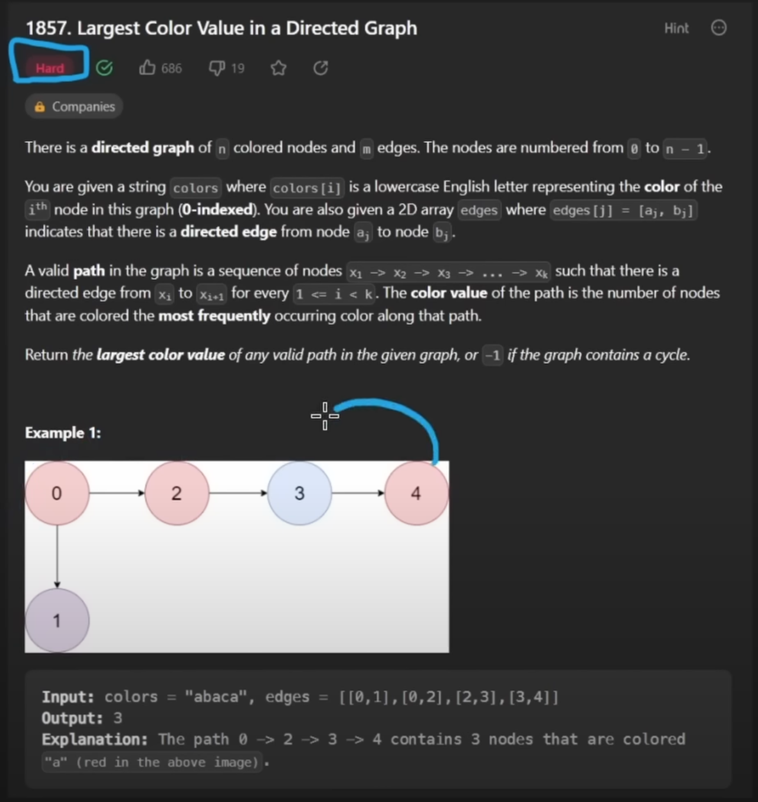

### Largest Color Value in a Directed Graph

## Interpreting the Question

It is a path question. There are a to z colors which means 26 possibilities. We are trying to find the path that maximizes the most frequent color. 
We want to return the frequency of the most frequent color.

We need to be aware of cycles and to return -1 if there is a cycle.

##