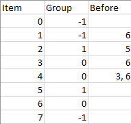
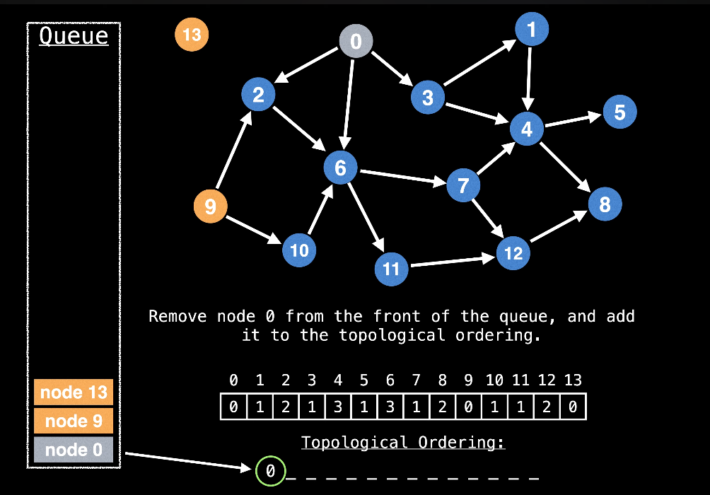
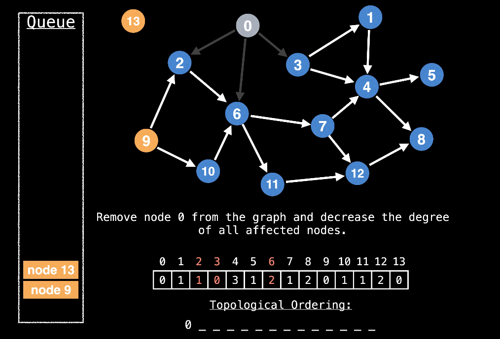
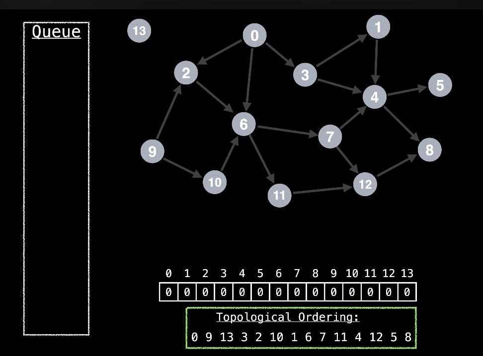

# Leetcode 1203: Sort Items By Groups

## What is this problem about
This problem is an extension of Topological Sort.

## Problem Description
```There are n items each belonging to zero or one of m groups where group[i] is the group that the i-th item belongs to and it's equal to -1 if the i-th item belongs to no group. The items and the groups are zero indexed. A group can have no item belonging to it.

Return a sorted list of the items such that:

The items that belong to the same group are next to each other in the sorted list.
There are some relations between these items where beforeItems[i] is a list containing all the items that should come before the i-th item in the sorted array (to the left of the i-th item).
Return any solution if there is more than one solution and return an empty list if there is no solution.
```

Example 1:


```
Input: n = 8, m = 2, group = [-1,-1,1,0,0,1,0,-1], beforeItems = [[],[6],[5],[6],[3,6],[],[],[]]
Output: [6,3,4,1,5,2,0,7]
Example 2:

Input: n = 8, m = 2, group = [-1,-1,1,0,0,1,0,-1], beforeItems = [[],[6],[5],[6],[3],[],[4],[]]
Output: []
Explanation: This is the same as example 1 except that 4 needs to be before 6 in the sorted list.
 
Constraints:

1 <= m <= n <= 3 * 104
group.length == beforeItems.length == n
-1 <= group[i] <= m - 1
0 <= beforeItems[i].length <= n - 1
0 <= beforeItems[i][j] <= n - 1
i != beforeItems[i][j]
beforeItems[i] does not contain duplicates elements.
```

## Solution Fundamentals

### Topological Sort Basics

Simply put, lets say there is a rule, dependencies, prerequisites where some evens must occur before others.

We are interested in generating a toplogical ordering.

Kahn's algorithm is a simple topo sort algorithm that can find a topological ordering in O(V + E) time.

A graph can have multiple topological orderings. The only graphs that can have topological orderings are DAGs.
DAG stands for Directed Acyclic Graph. This means the graph has no cycles.

### Kahn's Algorithm Intuition:

The intuition behind Kahn's algorithm is to repatedly remove nodes without any dependencies from the graph and them to the topological ordering.

As nodes without dependencies and outgoing edges are removed from the graph, new nodes without dependencies should become free.

We will be doing this usind Indegree and a stack.

We repeat the process of removing nodes without dependencies from the graph until all nodes are processed or a cycle is discovered.



Start by adding nodes with indegree of 0 to the queue.

When you remove a node from the queue, you decrease the indegree of all nodes which have a dependency on the node you removed.



You then continue this process by constantly add nodes with indegree of 0 to queue, remove nodes from the queue and add to the ordering.

Until you get an ordering like:




## How to Approach the Question:

We are given n tasks and m groups.

The first thing we do is change the -1s in the input array, we assign them a group and we update the group count.

```
m = 2
initialGroup = [-1,-1,1,0,0,1,0,-1]
//we update the number of groups for each -1
newGroup = [2, 3, 1, 0, 0, 1, 0, 4]
newM = 4

```
Then we create the Item Graph.

Finally, we topologically sort the group and the items.

Items Sorted: [0, 7, 6, 1, 3, 5, 2, 4]

Groups Sorted: [0, 2, 4, 1, 3]

{ 
    0 -> (6, 3, 4)
    1 -> (5, 2)
    2 -> (0)
    3 -> (0, 1)
    4 -> (7)
}

### Psuedo Code

```
// Change Group IDs

id = m
for (i = 0 to n)
    if (g[i] == -1):
        g[i] = m ++;

//from graphs & indegree
itemGraph; groupGraph;
ii[] gi[]
//ii = itemIndegree, gi = groupIndegree

for (i = 0 to n)
    for (before: beforeItems):
        ii[before].add(i)
        ii[i]++;
        if (group[i] != group[before]):
            groupGraph[group[before].add[group[i]]]
            gI[group[i]]++;
//now we toposort items and groups separetely
itemOrder = TS(items)
groupOrder = TS(groups)

for(i : item Order)
    orderedGroups[g[i]].add(i)

ans = [] #create ans array

for (g : groupOrder)
    ans.addAll(orderedGroups[g])
return ans

```
In the case where there are interdependencies on items/groups we return empty lists.

### Actual Code: